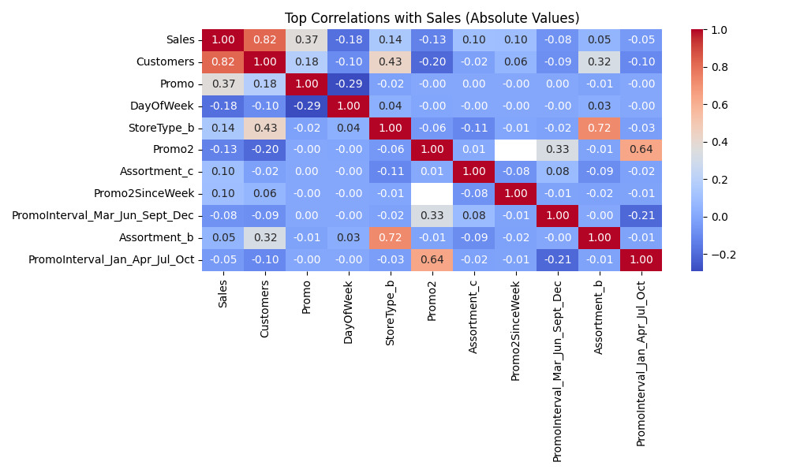
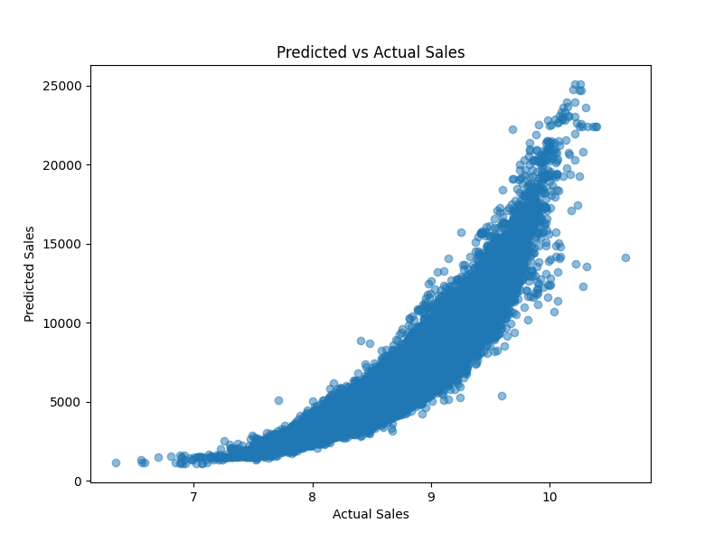

# 📊 Sales Forecasting with XGBoost | Capstone Project

This project forecasts 6-week future sales using a custom ML pipeline built with **XGBoost**, along with detailed data preprocessing, time-aware train-test split, feature engineering, model evaluation, and future prediction.

---

## 🗂️ Project Structure

sales_forecasting/
├── data/ # Raw data (train.csv, store.csv)
├── notebooks/
│ ├── sales_forecasting_RaghavendraSiddappa.ipynb ✅ My notebook
│ ├── xgboost_predictions.csv ✅ Evaluation results
│ ├── xgboost_future_forecast.csv ✅ 6-week forecast
│ ├── final_xgboost_model.pkl ✅ Trained model
├── scripts/
│ └── preprocessing.py # Optional reusable preprocessing
├── config/
│ └── config.yaml # Reserved for future config
├── requirements.txt # Python packages
└── README.md # This file


---

## 🔍 Problem Statement

To forecast daily **sales** for each Rossmann store using historical sales and store-related data, while ensuring:

- 💡 Realistic time-aware validation
- 🧮 Model performance with R², RMSE, and MAPE
- 📈 Future 6-week forecasting
- 🎯 Promo impact analysis

---

## 🛠️ Steps Performed

1. **Data Merging & Cleaning**
   - Merged `train.csv` and `store.csv`
   - Removed closed stores and zero-sales days
   - Handled categorical variables via one-hot encoding

2. **Feature Engineering**
   - Extracted `DayOfWeek`, `Promo`, `SchoolHoliday`, and store-specific features
   - Handled skewness using `log1p(Sales)`

3. **Time-aware Train/Test Split**
   - Used last **6 weeks** for testing (not random split)
   - Ensured no data leakage across time

4. **Model Training & Evaluation**
   - Trained models: `XGBoost`, `LightGBM`, `CatBoost`
   - Metrics used: `RMSE`, `R²`, `MAPE`

5. **Best Model**
   - ✅ **XGBoost** gave:
     - R² = **0.9079**
     - RMSE ≈ **926.88**
     - MAPE ≈ **8.89%**

6. **Promo Analysis**
   - Visualized sales distributions with and without `Promo`
   - Observed higher average sales during promotions

7. **Future Forecasting**
   - Predicted sales for the next **42 days** (6 weeks)
   - Saved results to `xgboost_future_forecast.csv`

---

## 📈 Sample Output

| Store | Date       | Predicted_Sales |
|-------|------------|-----------------|
| 1     | 2015-07-01 | 5567.23         |
| 1     | 2015-07-02 | 5478.14         |
| ...   | ...        | ...             |

---

## 📊 Visual Insights

### 📌 Sales Distribution (Skewness)


### 📌 Correlation Heatmap


### 📌 Promo Impact on Sales


### 📌 Model Prediction Fit


### 📌 Feature Importance - XGBoost


---

## 🚀 How to Run

```bash
git clone https://github.com/your-username/sales-forecasting-xgboost.git
cd sales-forecasting-xgboost
python -m venv venv
source venv/bin/activate       # or .\venv\Scripts\activate (Windows)
pip install -r requirements.txt
jupyter lab

```

