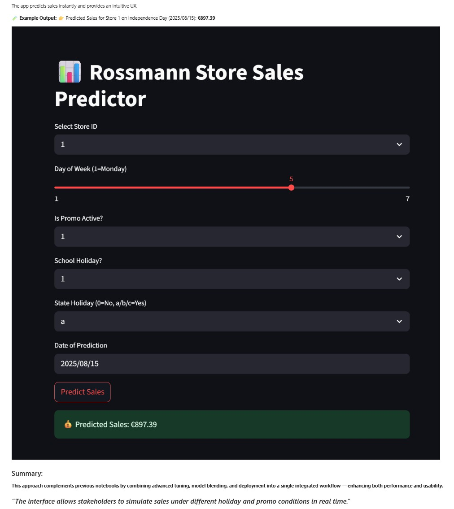

# Rossmann Store Sales Forecasting 

<p align="center">
  
  
  
  
  
</p>

<br>

This project predicts daily sales for Rossmann stores using historical data, promotions, holidays, and competition details. The final notebook demonstrates **five distinct approaches** to improve accuracy, interpretability, and deployability.

---
## Problem Statement

To forecast daily **sales** for each Rossmann store using historical sales and store-related data, while ensuring:

- 💡 Realistic time-aware validation
- 🧮 Model performance with R², RMSE, and MAPE
- 📈 Future 6-week forecasting
- 🎯 Promo impact analysis

---

## Steps Performed

1. **Data Merging & Cleaning**
   - Merged `train.csv` and `store.csv`
   - Removed closed stores and zero-sales days
   - Handled categorical variables via one-hot encoding

2. **Feature Engineering**
   - Extracted `DayOfWeek`, `Promo`, `SchoolHoliday`, and store-specific features
   - Handled skewness using `log1p(Sales)`

3. **Time-aware Train/Test Split**
   - Used last **6 weeks** for testing (not random split)
   - Ensured no data leakage across time

4. **Model Training & Evaluation**
   - Trained models: `XGBoost`, `LightGBM`, `CatBoost`
   - Metrics used: `RMSE`, `R²`, `MAPE`

5. **Best Model**
   - ✅ **XGBoost** gave:
     - R² = **0.9079**
     - RMSE ≈ **926.88**
     - MAPE ≈ **8.89%**

6. **Promo Analysis**
   - Visualized sales distributions with and without `Promo`
   - Observed higher average sales during promotions

7. **Future Forecasting**
   - Predicted sales for the next **42 days** (6 weeks)
   - Saved results to `xgboost_future_forecast.csv`

---

## Project Structure

```
sales_forecasting/
├── notebooks/
│   └── sales_forecasting_RaghavendraSiddappa.ipynb   # Final notebook
├── assets/                                           # Visualizations, heatmaps, feature importance plots
├── scripts/                                          # streamlit app.py for live demo
├── data/                                             # raw & preprocessed data
├── requirements.txt                                  # environment dependencies
└── README.md                                         # you're here!
```

---

## Approaches Explained

### 🔹 **Approach 1: Classical ML Models**
- Models Used: Linear Regression, Decision Tree, Random Forest, XGBoost, LightGBM, CatBoost
- Feature Engineering: Holiday flags, competition distance, promo durations
- Outcome: MAE ~346, R² ~0.96

### 🔹 **Approach 2: Store Clustering + Grouped Models**
- Clustering using KMeans on store-wise sales patterns
- Model per cluster for better specialization
- Outcome: Best MAPE per cluster ~8.8%, improved explainability

### 🔹 **Approach 3: Streamlit Interactive App**
- Inputs: Store ID, Date, Promo status
- Output: Forecasted sales instantly with user-friendly UI
- Deployed locally using `streamlit run app.py`

### 🔹 **Approach 4: MLJAR AutoML Pipeline**
- Framework: MLJAR AutoML (`mljar-supervised`) with GPU support
- Models: LightGBM, XGBoost, CatBoost, Stacking & Ensembling
- Performance:
  - ✅ R² Score = **96.08%**
  - ✅ RMSE ≈ **615**
- Fully automated: Feature engineering, hyperparameter tuning, and validation
- Ideal for production use and reproducibility
- Visualizations included: `actual_vs_predicted_sales.png`, `sales_forecast_report.html`

### 🔹 **Approach 5: Time Series Forecasting (SARIMA & Prophet)**

- Used Facebook Prophet to model store-level time series with holiday and seasonality components.
- Applied SARIMA (Seasonal ARIMA) for one store to understand seasonality, stationarity, and trends.
- Performed STL decomposition to visualize trend/seasonal/residual components.
- Evaluated predictions using MAPE for each model.
- ✅ Prophet MAPE: ~13%
- ✅ SARIMA MAPE (store 1): ~15%
- These models helped validate the feasibility of classical time series approaches vs ML-based models.

---

## Tools & Libraries
- Python, Pandas, NumPy, Matplotlib, Seaborn
- XGBoost, LightGBM, CatBoost, Scikit-learn
- KMeans (Clustering), Streamlit

---

## Results Summary

| Approach         | RMSE               | R²                         | MAPE                 |
| ---------------- | ------------------ | -------------------------- | -------------------- |
| Classical        | \~926              | \~0.91                     | \~8.9%               |
| Clustering       | Varies             | High                       | \~8.8% best          |
| Streamlit        | ✓ App functional   | ✓ UI Verified              | Live demo            |
| MLJAR AutoML     | \~615              | \~0.96                     | \~6.8%               |
| SARIMA + Prophet | \~Varies by config | Good for trend/seasonality | Time-series specific |

---

## Insights
- Promo duration, holiday flags, and store types play a major role.
- Cluster-wise modeling boosts contextual accuracy.
- Streamlit interface enables instant predictions for business users.

## 🎯 Streamlit Sales Predictor UI

This app enables real-time simulation of sales forecasts based on various inputs like promos, holidays, and dates.



**Example Output:**
👉 Predicted Sales for Store 1 on Independence Day (2025/08/15): **€897.39**

> *The interface allows stakeholders to simulate sales under different holiday and promo conditions in real time.*

---

## How to Run the App

```bash
pip install -r requirements.txt
cd scripts/
streamlit run app.py
```

---

## Conclusion

**This project implemented a wide range of machine learning and time series forecasting techniques to accurately predict Rossmann store sales. We demonstrated both model-based (XGBoost, MLJAR) and time-aware forecasting (SARIMA, Prophet) approaches. SARIMA captured weekly seasonality effectively, while Prophet offered interpretability with trend/season components. The project is reproducible, well-documented, and showcases readiness for real-world retail forecasting challenges.**


---

## 🔗 Credits

- Dataset: [Rossmann Store Sales](https://www.kaggle.com/c/rossmann-store-sales)
- Author: Raghavendra Siddappa

---

*For queries or improvements, feel free to open an issue or pull request!*

